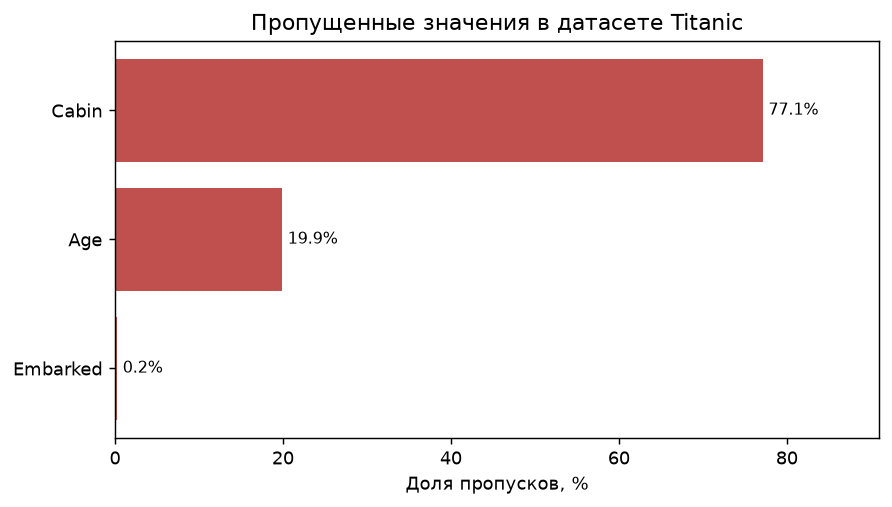
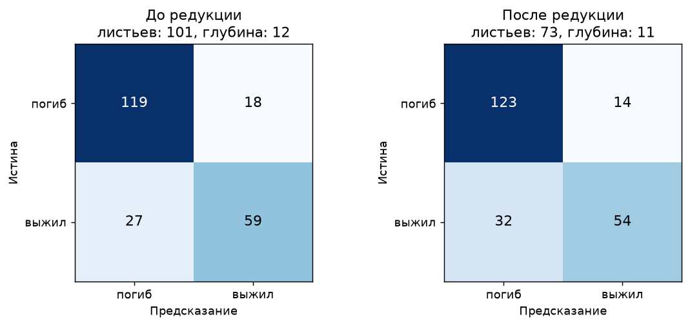
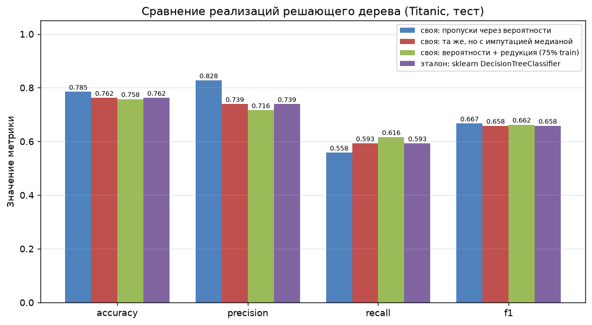
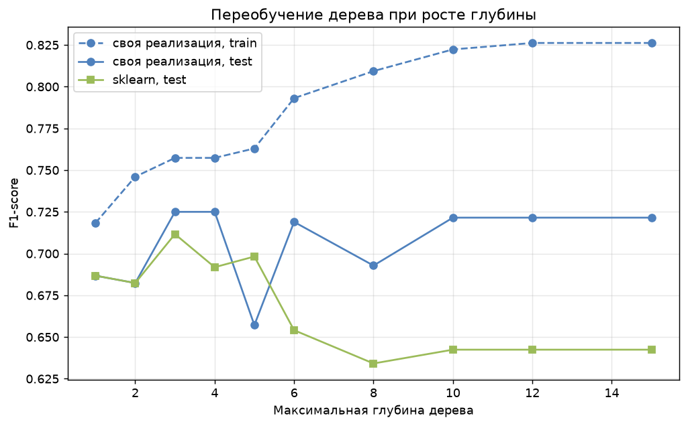
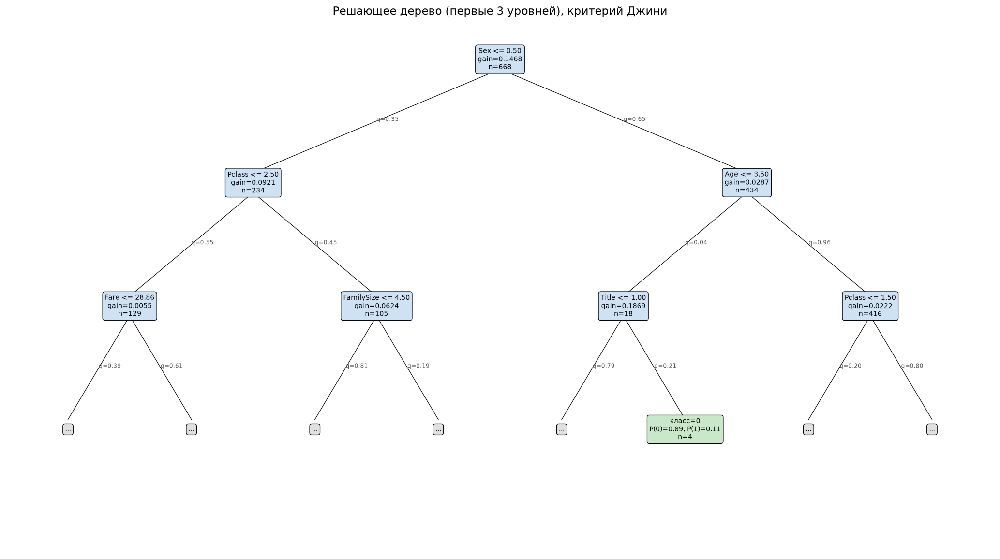

# Лабораторная работа №1. Решающие деревья

**Студент:** Хакимов В. М.

## Задача

Реализовать бинарное решающее дерево ID3 с критерием Джини, обработку пропусков
через вероятности и редукцию дерева. Сравнить с `DecisionTreeClassifier`
из sklearn.

## Датасет

**Titanic** ([kaggle](https://www.kaggle.com/datasets/yasserh/titanic-dataset)),
скачивается при запуске через `kagglehub`. Выбран потому, что в нём есть и
пропуски, и категориальные признаки — оба требования задания.

| | |
|---|---|
| Объектов | 891 (668 train / 223 test) |
| Признаков | 12 → 11 после предобработки |
| Классы | 549 погибших / 342 выживших |
| Пропуски | `Cabin` 77.1%, `Age` 19.9%, `Embarked` 0.2% |



Из `Name` извлечён `Title`, из `Cabin` — `Deck`, добавлены `FamilySize` и
`IsAlone`, категории закодированы числами. Пропуски **не заполняются** — с ними
работает само дерево.

## Результаты

### Подбор гиперпараметров

Перебор 54 комбинаций, 5-фолдовая CV по F1, 5.9 с. Лучшее: `max_depth=6`,
`min_samples_split=10`, `min_samples_leaf=1`, **CV F1 = 0.7625 ± 0.0218**.

### Редукция дерева

| Дерево | Редукция | Листьев | F1 train | F1 val | Acc test |
|---|---|---|---|---|---|
| оптимальное | до | 29 | 0.8320 | 0.7879 | 0.7444 |
| оптимальное | **после** | **22** | 0.8054 | **0.8226** | **0.7578** |
| переобученное | до | 101 | 0.9280 | 0.7903 | 0.7982 |
| переобученное | **после** | **73** | 0.8385 | **0.8305** | 0.7937 |



Редукция убирает 24-28% листьев и сокращает разрыв train/val. На тесте эффект в
пределах шума (валидация всего 167 объектов). Польза — компактная модель почти
без потери качества.

### Сравнение с эталоном

| Модель | Accuracy | F1 | ROC-AUC | Обучение, с |
|---|---|---|---|---|
| **своя: пропуски через вероятности** | **0.7848** | **0.6667** | **0.8274** | 0.026 |
| своя: то же, но с импутацией медианой | 0.7623 | 0.6581 | 0.8115 | 0.027 |
| своя: вероятности + редукция | 0.7578 | 0.6625 | 0.7767 | 0.021 |
| эталон: sklearn | 0.7623 | 0.6581 | 0.8100 | **0.003** |



Главное — во второй строке. Тот же код с теми же параметрами, отличается только
обработка пропусков, и он даёт **в точности** метрики sklearn. Значит алгоритм
построения дерева совпадает с эталонным, а весь выигрыш первой строки
(**+2.3 п.п.**) — заслуга работы с пропусками.

Логично для датасета, где у признака отсутствует 77% значений: импутация
стирает разницу между «каюта неизвестна» и «каюта как у большинства», хотя
первое само по себе сильный признак.

По скорости эталон быстрее **в 10 раз** (Cython против Python-цикла).

### Переобучение по глубине



| Глубина | 1 | 3 | 4 | 6 | 8 | 10 | 15 |
|---|---|---|---|---|---|---|---|
| своё, train | 0.718 | 0.757 | 0.757 | 0.793 | 0.809 | 0.822 | 0.826 |
| своё, test | 0.687 | **0.725** | **0.725** | 0.719 | 0.693 | 0.722 | 0.722 |
| sklearn, test | 0.687 | **0.712** | 0.692 | 0.654 | 0.634 | 0.642 | 0.642 |

Обе реализации дают максимум на глубине 3-4. Дальше sklearn падает до 0.634, а
своё дерево держится около 0.72: «размазывание» объектов с пропусками по обеим
ветвям работает как регуляризация.



Корень дерева — `Sex`, для Titanic ожидаемо. На рёбрах подписаны веса `q`, по
которым распределяются объекты с пропусками.

## Выводы

1. Реализованы критерий Джини, бинаризация вещественных признаков за
   O(n log n), вероятностная обработка пропусков и редукция.
2. **Обработка пропусков — единственный источник прироста:** тот же алгоритм с
   импутацией даёт ровно метрики sklearn (0.7623), с вероятностями — 0.7848.
3. Редукция сокращает дерево на 24-28% листьев почти без потери качества.
4. Проигрыш по скорости **≈10×** — цена Python против Cython.
5. Оптимум по CV (глубина 6) не совпал с оптимумом по тесту (3-4): на 891
   объекте оценка гиперпараметров сама шумная.

## Запуск

```
lab1/
├── README.md
├── images/
└── source/
    ├── tree.py            # построение, пропуски, редукция
    ├── dataset.py         # загрузка Titanic и предобработка
    ├── plots.py           # графики
    └── main.py            # сценарий эксперимента
```

```sh
pip install numpy pandas scikit-learn matplotlib kagglehub
cd source && python main.py
```

Метрики воспроизводятся при повторном запуске; время зависит от машины.
