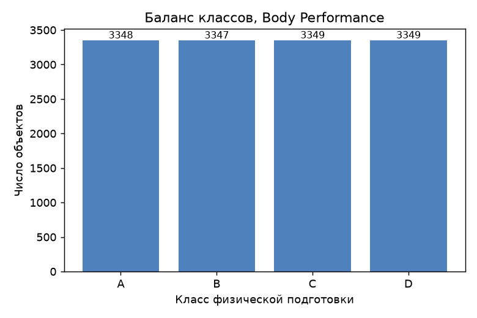
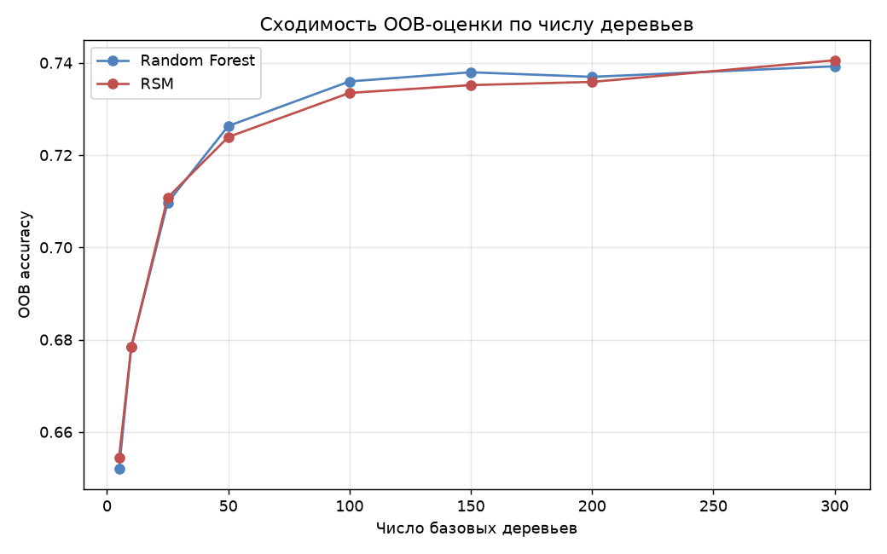
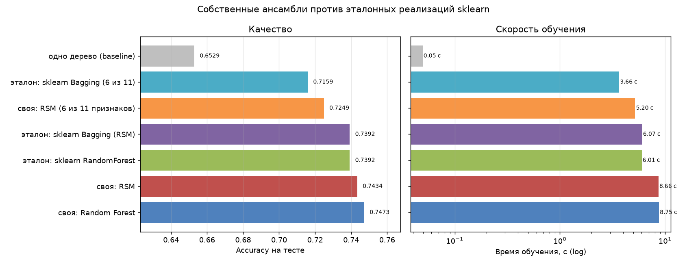
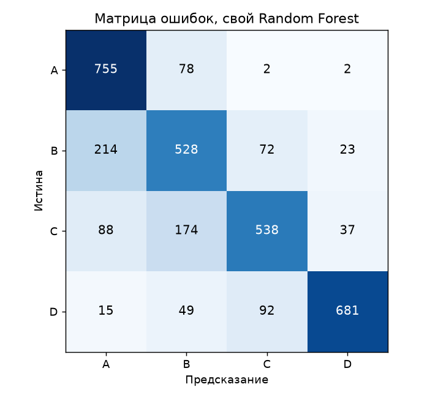
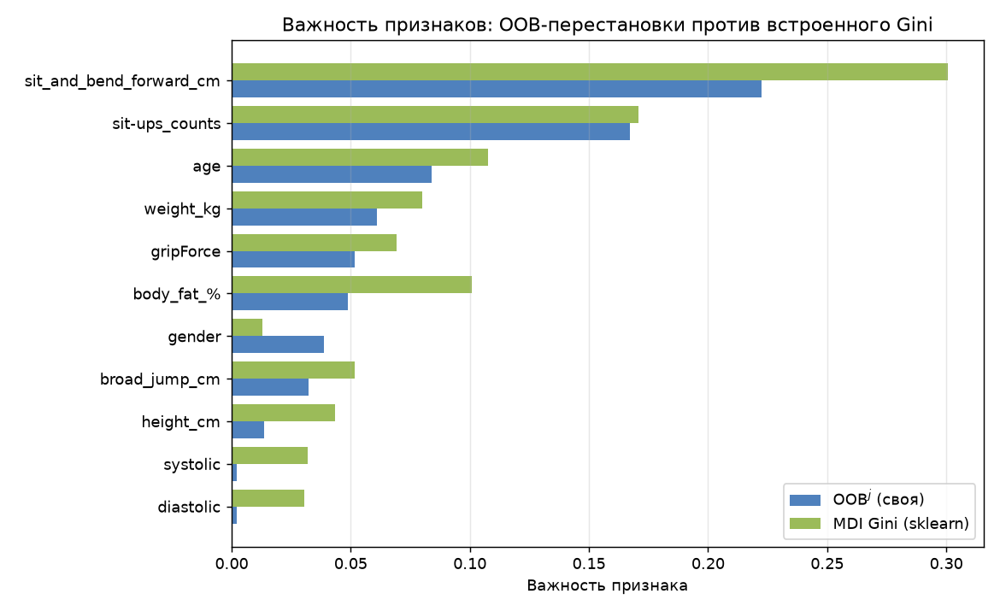

# Лабораторная работа №2. Ансамбли моделей (Random Forest и RSM)

**Студент:** Хакимов В. М.

## Задача

Реализовать Random Forest и метод случайных подпространств, подобрать
гиперпараметры по OOB, посчитать важности признаков через `OOB^j` и сравнить с
эталонами sklearn. Реализованы оба метода — так виден вклад каждого источника
случайности.

Базовый алгоритм — библиотечное дерево (задание это разрешает); ансамбль,
голосование, OOB-оценка и важности написаны вручную.

## Датасет

**Body Performance** ([kaggle](https://www.kaggle.com/datasets/kukuroo3/body-performance-data)),
скачивается при запуске через `kagglehub`.

| | |
|---|---|
| Объектов | 13 393 → 13 392 после удаления дублей |
| Признаков | 11 (10 количественных + `gender`) |
| Классы | 4 (A/B/C/D), почти поровну |
| Пропуски | нет |



Пол закодирован 0/1; нули в `diastolic` и `systolic` физически невозможны —
заменены медианой. Разбиение 10 044 / 3 348, стратифицированное.

## Результаты

### Подбор гиперпараметров по OOB

Использован `GridSearchCV`, но отбор идёт по OOB, а не по обычной CV: скорер
берёт `est.oob_score_`, «фолд» один и на всей обучающей выборке. Утечки нет —
OOB считается внутри модели на объектах вне бутстрэпа. Схема **в 5 раз дешевле**
5-фолдовой CV: 27 комбинаций за 12 с.

Обе модели выбрали `max_features=None`, `max_depth=None`, `min_samples_leaf=3`.
Лучший OOB: **0.7360** (RF) и **0.7335** (RSM). Выбор всех 11 признаков логичен:
сужение подпространства нужно, когда признаков много и они избыточны, а здесь
каждый несёт свою информацию.

### Сходимость OOB



| Деревьев | 5 | 25 | 50 | 100 | 200 | 300 |
|---|---|---|---|---|---|---|
| Random Forest | 0.652 | 0.710 | 0.726 | 0.736 | 0.737 | 0.739 |
| RSM | 0.655 | 0.711 | 0.724 | 0.734 | 0.736 | 0.741 |

Основной прирост — до 100 деревьев, дальше плато (+0.3 п.п. на следующих 200).
Переобучения от числа деревьев нет — этим бэггинг и отличается от бустинга.

### Сравнение с эталонами

Все ансамбли — по 200 деревьев с одинаковыми гиперпараметрами.

| Модель | OOB | Accuracy | F1-macro | Обучение, с |
|---|---|---|---|---|
| **своя: Random Forest** | 0.7370 | **0.7473** | **0.7463** | 8.75 |
| **своя: RSM** | 0.7359 | 0.7434 | 0.7424 | 8.66 |
| эталон: `RandomForestClassifier` | 0.7360 | 0.7392 | 0.7380 | 6.01 |
| эталон: `BaggingClassifier` (RSM) | 0.7371 | 0.7392 | 0.7379 | 6.07 |
| своя: RSM (6 из 11 признаков) | 0.7108 | 0.7249 | 0.7218 | 5.20 |
| одно дерево (baseline) | — | 0.6529 | 0.6533 | 0.05 |




**Качество.** Свои реализации чуть впереди (+0.8 и +0.9 п.п.), но разрыв в
пределах разброса между запусками и объясняется разной трактовкой случайности:
у меня каждое дерево получает свой `random_state`, у `BaggingClassifier` он
общий.

**Скорость.** Эталон быстрее **в 1.46 раза** — гораздо меньше, чем 10× в ЛР1,
потому что деревья в обоих случаях строит один и тот же Cython-код sklearn.
Мой оверхед — Python-цикл по 200 деревьям.

**Ансамбль против одного дерева:** 0.6529 → 0.7473, **+9.4 п.п.** — ровно то,
ради чего бэггинг придуман. RF стабильно чуть лучше RSM: он выбирает признаки
заново в каждом узле, поэтому сильный признак доступен на любом уровне.

### Важность признаков через OOB^j



| Признак | OOB^j | Gini MDI (sklearn) |
|---|---|---|
| `sit_and_bend_forward_cm` | **0.2224** | 0.3005 |
| `sit-ups_counts` | 0.1672 | 0.1709 |
| `age` | 0.0839 | 0.1077 |
| `weight_kg` | 0.0611 | 0.0800 |
| `gripForce` | 0.0516 | 0.0691 |
| `body_fat_%` | 0.0487 | 0.1010 |
| `gender` | 0.0387 | 0.0130 |
| `systolic` / `diastolic` | 0.0020 | 0.031 |

Топ осмыслен: наклон вперёд и подъёмы корпуса — прямые тесты гибкости и
выносливости, то есть буквально то, что оценивает целевая переменная.

Два метода расходятся в предсказуемых местах. На давлении MDI показывает 0.031,
а OOB^j — ноль: у давления много уникальных значений, Gini находит на нём
случайные удачные разбиения, которые на новых объектах не работают. На `gender`
наоборот — бинарный признак даёт мало вариантов разбиения и в MDI
недооценивается.

Проверка: лес только на топ-5 признаках даёт accuracy **0.7219** против 0.7473
на всех 11 — потеря 2.5 п.п. при вдвое меньшем числе признаков.

## Выводы

1. Реализованы RF и RSM с бутстрэпом, мягким голосованием, OOB-оценкой и
   OOB-важностями.
2. Подбор по OOB через `GridSearchCV` корректен и **в 5 раз дешевле** обычной
   5-фолдовой CV.
3. Обе реализации немного обошли эталоны по качеству и проиграли по скорости
   **в 1.45 раза**.
4. Ансамбль даёт **+9.4 п.п.** к одиночному дереву — основной результат работы.
5. При 11 признаках сужение подпространства **вредит** (0.7473 против 0.7249):
   `max_features="sqrt"` рассчитан на данные с десятками избыточных признаков.
6. **OOB^j честнее встроенного Gini** — на признаках с большим числом
   уникальных значений MDI видит сигнал там, где его нет.
7. При сравнении с эталоном важно проверять эквивалентность конфигураций:
   `BaggingClassifier` переводит долю признаков в число через `int()`, а моя
   реализация — через `round()`, и это давало ложное преимущество в 3.2 п.п.

## Запуск

```
lab2/
├── README.md
├── images/
└── source/
    ├── ensemble.py       # RF, RSM, OOB, OOB^j
    ├── dataset.py        # загрузка Body Performance
    ├── plots.py          # графики
    └── main.py           # сценарий эксперимента
```

```sh
pip install numpy pandas scikit-learn matplotlib kagglehub
cd source && python main.py
```

Метрики воспроизводятся при повторном запуске; время зависит от машины.
