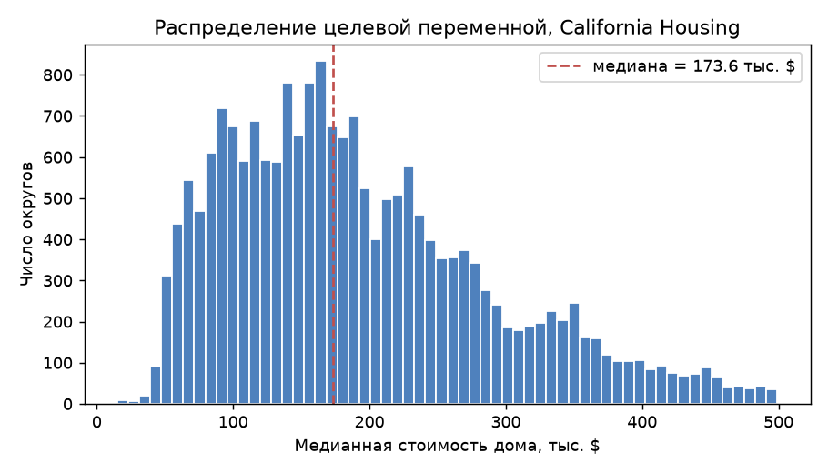
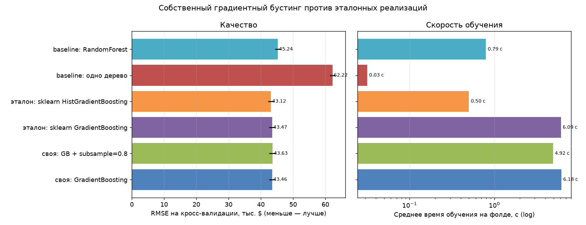
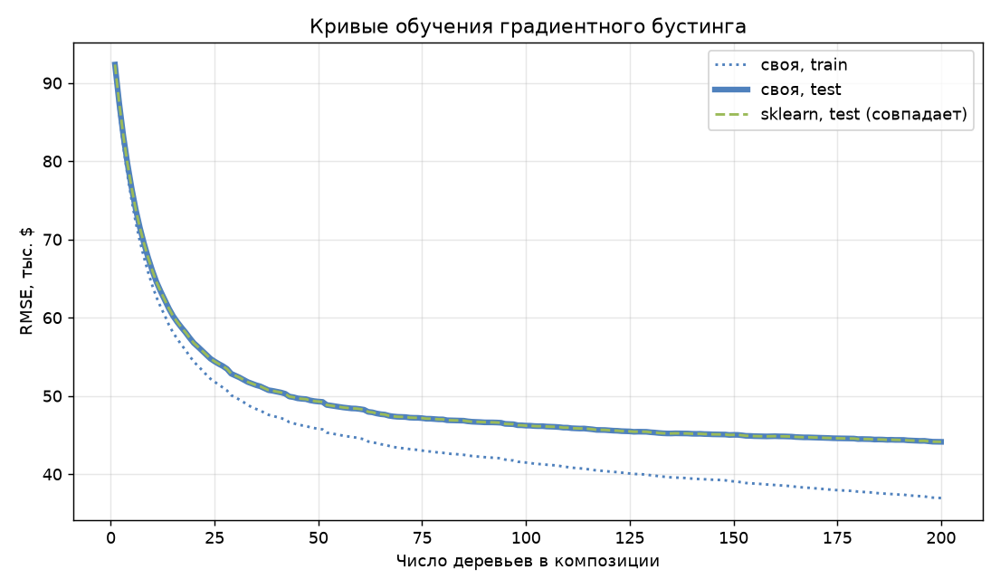
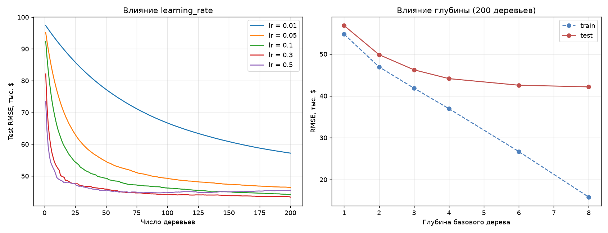
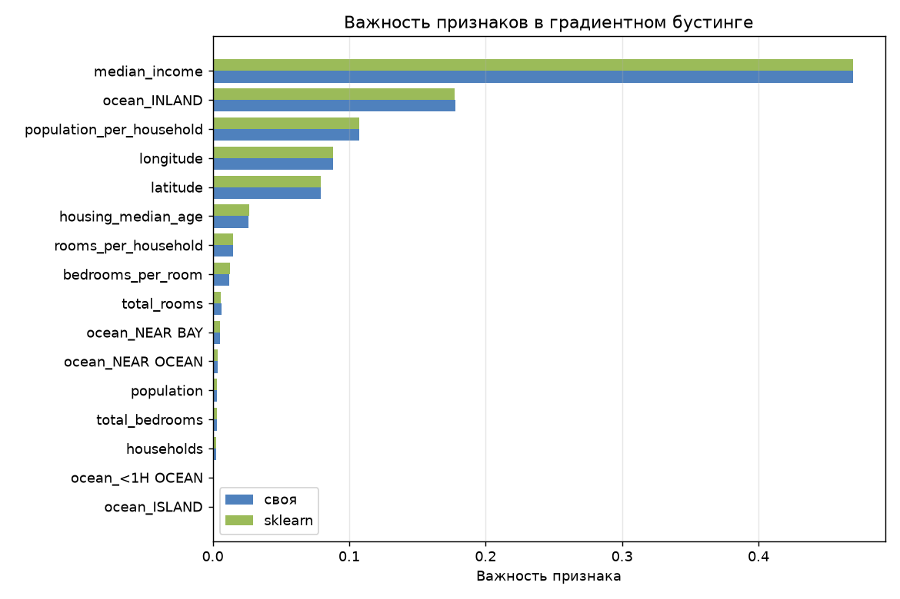

# Лабораторная работа №3. Градиентный бустинг

**Студент:** Хакимов В. М.

## Задача

Реализовать градиентный бустинг, оценить качество по кросс-валидации, замерить
время обучения и сравнить с эталоном из sklearn.

Базовый алгоритм — библиотечное дерево; логика бустинга, функции потерь и шаг
Ньютона написаны вручную.

## Датасет

**California Housing** ([kaggle](https://www.kaggle.com/datasets/camnugent/california-housing-prices)),
скачивается при запуске через `kagglehub`.

| | |
|---|---|
| Объектов | 20 640 → **19 648** после предобработки |
| Признаков | 9 → **16** после feature engineering |
| Задача | регрессия (медианная цена дома в округе) |
| Целевая переменная | медиана 173.6, std 97.1 (тыс. $) |



Добавлены душевые признаки `rooms_per_household`, `bedrooms_per_room`,
`population_per_household` — абсолютные счётчики по округу зависят прежде всего
от его размера. `ocean_proximity` закодирован one-hot, 207 пропусков в
`total_bedrooms` заполнены медианой. Удалены 992 объекта с ценой `>= 500 001`:
в исходных данных она обрезана сверху и эти объекты образуют пик на границе.

Разбиение: 15 718 / 3 930.

## Результаты

### Кросс-валидация

5 фолдов, 200 деревьев, `learning_rate=0.1`, `max_depth=4`.

| Модель | RMSE | MAE | R² | Обучение, с |
|---|---|---|---|---|
| **своя: GradientBoosting** | **43.4619** | 29.9635 | 0.7986 | 6.18 |
| своя: GB + `subsample=0.8` | 43.6278 | 30.0974 | 0.7971 | 4.92 |
| эталон: `GradientBoostingRegressor` | 43.4687 | 29.9658 | 0.7985 | 6.09 |
| эталон: `HistGradientBoostingRegressor` | **43.1205** | **29.6803** | **0.8018** | **0.50** |
| baseline: одно дерево | 62.2201 | 45.9478 | 0.5876 | 0.03 |
| baseline: RandomForest | 45.2383 | 30.4988 | 0.7819 | 0.79 |



### Сравнение с эталоном



| Деревьев | 1 | 10 | 25 | 50 | 100 | 200 |
|---|---|---|---|---|---|---|
| своя, train RMSE | 91.214 | 64.107 | 51.816 | 45.782 | 41.482 | 36.945 |
| своя, test RMSE | **92.350** | **66.015** | **54.407** | **49.278** | 46.201 | 44.131 |
| sklearn, test RMSE | **92.350** | **66.015** | **54.407** | **49.278** | 46.194 | 44.130 |

**Качество совпадает полностью.** Первые 50 деревьев дают побитово одинаковые
значения, дальше расхождение только в четвёртом знаке. Значит реализация не
«похожа» на эталон, а воспроизводит его.

**По скорости паритет:** 6.18 с против 6.09 с — разница в пределах погрешности.
И там, и там деревья строит один и тот же Cython-код, а мой оверхед — цикл по
200 итерациям на NumPy.

Быстрее всех `HistGradientBoosting` (0.50 с, **в 12 раз**), но это **другой
алгоритм**: он раскладывает признаки по 256 корзинам, и поиск разбиения
перестаёт зависеть от числа объектов. Честное сравнение — с классическим
`GradientBoostingRegressor`.

Стохастический бустинг (`subsample=0.8`) не помог по качеству, но ускорил
обучение на 20%. Бустинг обошёл бэггинг (43.46 против 45.24 у RandomForest),
но обучается последовательно и не распараллеливается по деревьям.

### Гиперпараметры



| `learning_rate` | 0.01 | 0.05 | 0.10 | **0.30** | 0.50 |
|---|---|---|---|---|---|
| test RMSE @200 | 57.198 | 46.428 | 44.131 | **43.352** | 45.455 |
| деревьев до лучшего | 200 | 200 | 200 | 200 | **94** |

Классический компромисс: при `lr=0.01` двухсот деревьев мало, при `lr=0.5`
минимум достигается на 94-м дереве, а дальше модель переобучается.

| `max_depth` | 1 | 2 | 3 | 4 | 6 | 8 |
|---|---|---|---|---|---|---|
| train RMSE | 54.746 | 46.938 | 41.844 | 36.945 | 26.693 | 15.808 |
| test RMSE | 56.816 | 49.857 | 46.236 | 44.131 | 42.558 | **42.167** |

Разрыв train/test растёт быстро, но тестовая ошибка всё ещё улучшается — данных
хватает, чтобы более сложные деревья окупались. Для основного сравнения
оставлена глубина 4, чтобы обе реализации были в равных условиях.

### Важность признаков



| Признак | своя | sklearn |
|---|---|---|
| `median_income` | 0.4693 | 0.4691 |
| `ocean_INLAND` | 0.1776 | 0.1774 |
| `population_per_household` | 0.1074 | 0.1074 |
| `longitude` | 0.0882 | 0.0883 |
| `latitude` | 0.0791 | 0.0791 |

Совпадение до третьего знака. Медианный доход объясняет почти половину
важности, а два из трёх созданных признаков попали в топ-7 — feature
engineering окупился.

> Сначала важности считались как среднее **нормированных** важностей отдельных
> деревьев, и картина была совсем другой (`median_income` 0.13 вместо 0.47).
> При такой нормировке 200-е дерево, подчищающее остатки, получает тот же вес,
> что и первое. Правильно — усреднять ненормированные значения.

### Бустинг для классификации

Та же композиция, но с логистической потерей и шагом Ньютона в листьях. Задача —
предсказать, дороже ли дом медианы.

| Модель | Accuracy | ROC-AUC | Обучение, с |
|---|---|---|---|
| своя: GB (`log_loss`) | **0.9043** | 0.9643 | 8.51 |
| эталон: `GradientBoostingClassifier` | 0.9041 | **0.9645** | 8.16 |

Accuracy на 5-фолдовой CV: **0.8922 ± 0.0039**. Совпадение в третьем знаке —
шаг Ньютона реализован верно.

## Выводы

1. Реализован градиентный бустинг с квадратичной и логистической потерями,
   шагом Ньютона в листьях, shrinkage и стохастическим подвыбором.
2. **Реализация полностью воспроизводит эталон:** RMSE 43.4619 против 43.4687,
   первые 50 точек кривой обучения совпадают побитово, важности — до третьего
   знака.
3. **По времени паритет** (6.18 с против 6.09 с), в отличие от 10× в ЛР1:
   тяжёлую работу в обоих случаях делает один и тот же Cython-код.
4. `HistGradientBoosting` быстрее в 12 раз за счёт гистограммного поиска
   разбиения — это другой алгоритм, а не лучшая реализация того же.
5. Бустинг обошёл бэггинг (43.46 против 45.24), но не распараллеливается.
6. Подтверждён компромисс `learning_rate` ↔ число деревьев.

## Запуск

```
lab3/
├── README.md
├── images/
└── source/
    ├── boosting.py       # бустинг, функции потерь, шаг Ньютона
    ├── dataset.py        # загрузка California Housing
    ├── plots.py          # графики
    └── main.py           # сценарий эксперимента
```

```sh
pip install numpy pandas scikit-learn matplotlib kagglehub
cd source && python main.py
```

Метрики воспроизводятся при повторном запуске; время зависит от машины.
