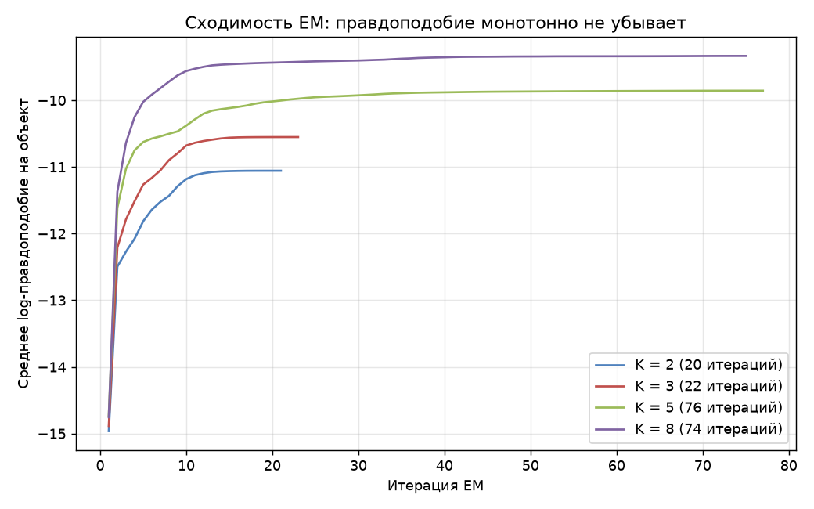
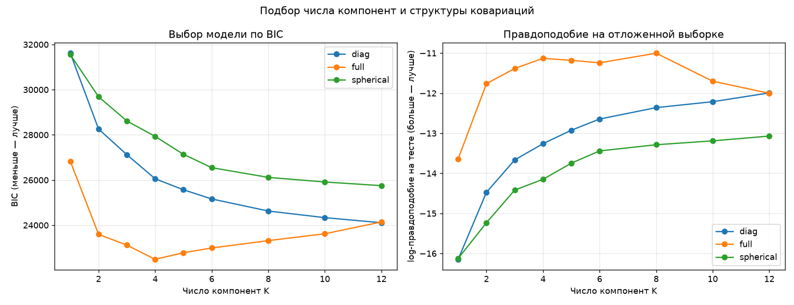
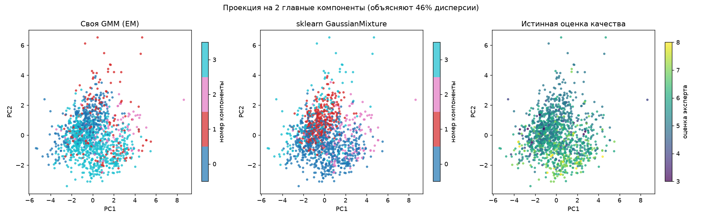
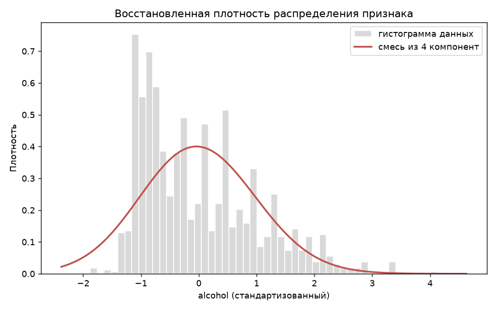

# Лабораторная работа №4. EM-алгоритм и смеси нормальных распределений

**Студент:** Хакимов В. М.

## Задача

Реализовать EM-алгоритм обучения GMM для восстановления плотности, выбрать число
компонент по принципу максимума правдоподобия и сравнить с эталонной
`sklearn.mixture.GaussianMixture`.

## Датасет

**Wine Quality — red** ([kaggle](https://www.kaggle.com/datasets/uciml/red-wine-quality-cortez-et-al-2009)),
скачивается при запуске через `kagglehub`.

| | |
|---|---|
| Объектов | 1 599 → **1 359** после удаления дублей |
| Признаков | 11 непрерывных физико-химических |
| Пропуски | нет |
| Метка `quality` | 3-8, **при обучении GMM не используется** |

Стандартизация обязательна: масштабы признаков различаются на три порядка
(плотность ≈ 0.997 против диоксида серы ≈ 46), без неё ковариационные матрицы
компонент почти вырождены. Разбиение: 1 019 / 340.

## Результаты

### Сходимость EM



Для K=4 с полными ковариациями алгоритм сошёлся за **45 итераций**.

| Итерация | 1 | 2 | 3 | 5 | 10 | 20 | 46 |
|---|---|---|---|---|---|---|---|
| log-правдоподобие | −15.019 | −11.669 | −11.200 | −10.868 | −10.514 | −10.139 | −9.979 |

За первые 2-3 итерации снимается основная часть разрыва, дальше медленная
доводка. Монотонность роста проверяется в коде явно.

### Выбор числа компонент



| cov | K | параметров | train | test | AIC | BIC |
|---|---|---|---|---|---|---|
| spherical | 12 | 155 | −12.11 | −13.07 | 24987.9 | 25751.6 |
| diag | 12 | 275 | −10.90 | −11.99 | 22754.7 | 24109.5 |
| full | 2 | 155 | −11.05 | −11.76 | 22832.1 | 23595.7 |
| full | 3 | 233 | −10.55 | −11.38 | 21969.7 | 23117.6 |
| **full** | **4** | **311** | **−9.98** | **−11.13** | 20959.3 | **22491.4** |
| full | 6 | 467 | −9.69 | −11.24 | 20691.0 | 22991.7 |
| full | 8 | 623 | −9.32 | **−11.00** | 20248.4 | 23317.6 |
| full | 12 | 935 | −8.67 | −12.00 | 19536.9 | 24143.2 |

**BIC выбирает `full`, K=4.** Правдоподобие на тесте здесь −11.13, почти
максимум (−11.00 при K=8), но модель вдвое проще.

На обучении правдоподобие растёт монотонно по K — это переобучение в чистом
виде: 935 параметров на 1019 объектов. На тесте кривая разворачивается: растёт
до K≈8, затем падает до −12.00 при K=12, хуже, чем при K=2. AIC выбирает
модели посложнее (минимум при K=12), потому что его штраф `2p` слабее, чем
`p·ln(1019) ≈ 6.9p` у BIC. На тесте прав BIC.

Полные ковариации однозначно лучше: при K=4 это −11.13 против −13.26 (diag) и
−14.15 (spherical). Показатели вина сильно скоррелированы (плотность связана с
сахаром и спиртом, pH с кислотностью), диагональная модель этого не видит.

### Сравнение с эталоном

| cov | K | своя test | sklearn test | своя, с | sklearn, с | итераций своя / sklearn |
|---|---|---|---|---|---|---|
| diag | 3 | **−13.666** | −14.004 | 0.040 | **0.023** | 24 / 12 |
| diag | 4 | −13.260 | **−13.216** | 0.072 | **0.039** | 36 / 17 |
| diag | 5 | **−12.925** | −13.047 | 0.082 | **0.054** | 67 / 34 |
| full | 3 | −11.383 | **−11.318** | 0.072 | **0.071** | 22 / 22 |
| full | 4 | −11.132 | **−11.086** | 0.164 | **0.077** | 45 / 21 |
| full | 5 | −11.180 | **−10.959** | 0.204 | **0.119** | 76 / 40 |

**Качество.** Расхождение на тесте не больше **0.34** при значениях порядка
−11...−14, то есть менее 3%. Разница не в формулах, а в том, в какой локальный
максимум попал конкретный запуск.

**Скорость.** Эталон быстрее везде, медиана замедления **1.7×**. Причина — не в
скорости итераций, а в их числе: моя реализация делает примерно вдвое больше
шагов EM. sklearn доводит стартовые центры полноценным k-means и стартует ближе
к оптимуму, здесь — только k-means++, остаток пути EM проходит сам. Там, где
обе реализации сошлись за одинаковое число итераций (`full` K=3, 22 против 22),
времена тоже сравнялись.

> Время — медиана по 7 повторам. Одиночные замеры здесь ненадёжны: значения
> порядка десятков миллисекунд, при нагрузке на машину менялись в разы.
> Метрики качества при этом во всех прогонах совпадали во всех знаках.

### Структура компонент



Веса компонент (K=4, full): своя `[0.516, 0.283, 0.132, 0.069]`, sklearn
`[0.502, 0.265, 0.128, 0.105]`. **ARI своя vs sklearn = 0.583.**

**ARI между компонентами и экспертной оценкой = 0.036**, практически ноль:

| Компонента | q=3 | q=4 | q=5 | q=6 | q=7 | q=8 |
|---|---|---|---|---|---|---|
| 0 | 1 | 16 | 228 | 102 | 11 | 3 |
| 1 | 4 | 11 | 67 | 51 | 32 | 2 |
| 2 | 3 | 5 | 45 | 31 | 4 | 1 |
| 3 | 2 | 21 | 237 | 351 | 120 | 11 |

Это не провал модели: GMM решала задачу восстановления плотности, а не
классификации. Она нашла кластеры по химическому составу, слабо связанные с
субъективной оценкой дегустатора. Небольшое смещение всё же есть — в компоненте
0 преобладают вина с оценкой 5, в компоненте 3 — с оценкой 6.



Маргинальная плотность по `alcohol` показывает, зачем нужна смесь: одна
нормальная компонента не описала бы ни асимметрию, ни пик у нижней границы.

### Байесовский классификатор на GMM

Задача: отличить хорошее вино (`quality >= 6`, 719 объектов) от остального (640).

| Модель | Accuracy | F1 | ROC-AUC | Время, с |
|---|---|---|---|---|
| GMM-байес, 1 комп./класс | 0.7147 | 0.7328 | 0.8117 | 0.007 |
| GMM-байес, 2 комп./класс | 0.7206 | **0.7607** | 0.8007 | 0.040 |
| GMM-байес, 3 комп./класс | 0.7235 | 0.7267 | 0.8117 | 0.077 |
| GMM-байес, 5 комп./класс | 0.7029 | 0.7003 | 0.7640 | 0.134 |
| эталон: `GaussianNB` | **0.7500** | 0.7536 | **0.8157** | **0.003** |

**Более сложная модель проиграла более простой** — самый интересный результат
раздела. Дело в соотношении числа параметров и данных: на ~500 объектах класса
полная ковариационная матрица 11×11 оценивается ненадёжно. Рост числа
компонент с 3 до 5 ухудшает результат, что подтверждает диагноз. Нереалистичное
предположение наивного байеса о независимости признаков работает здесь как
жёсткая регуляризация.

## Выводы

1. Реализованы GMM и EM с полными, диагональными и сферическими ковариациями,
   инициализацией k-means++, `logsumexp` и разложением Холецкого.
2. По BIC оптимальна смесь из **4 компонент с полными ковариациями**. AIC
   систематически выбирает более сложные модели и здесь ошибается.
3. Реализация **совпала с эталоном по качеству** (расхождение менее 3%) и
   отстала по скорости в **1.7 раза**. Отставание — из-за числа итераций, а не
   их стоимости: без k-means-доводки центров EM требует вдвое больше шагов.
4. Компоненты **не соответствуют экспертным оценкам** (ARI = 0.036) — ожидаемо,
   задача была не классификационная.
5. GMM-байес **проиграл наивному байесу** (0.7235 против 0.7500): при 11
   признаках и ~500 объектах на класс полная ковариация слишком ненадёжна.

## Запуск

```
lab4/
├── README.md
├── images/
└── source/
    ├── gmm.py            # GMM + EM, байесовский классификатор
    ├── dataset.py        # загрузка Wine Quality и стандартизация
    ├── plots.py          # графики
    └── main.py           # сценарий эксперимента
```

```sh
pip install numpy pandas scikit-learn matplotlib kagglehub
cd source && python main.py
```

Метрики воспроизводятся при повторном запуске; время зависит от машины.
