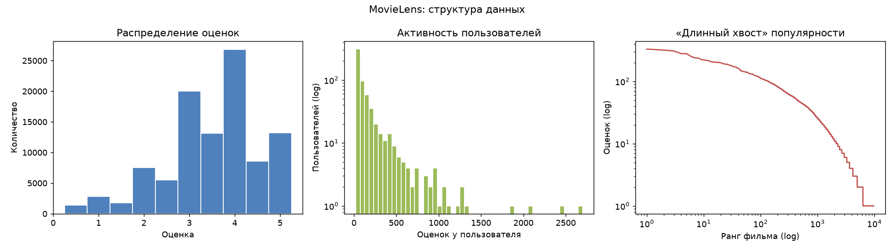
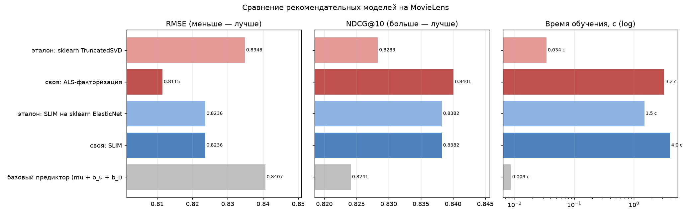
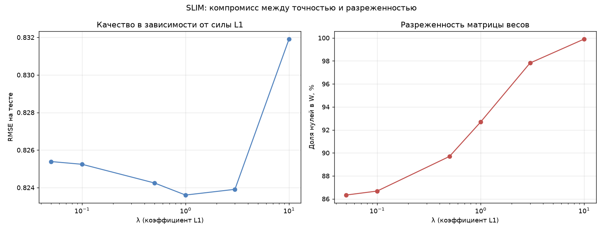
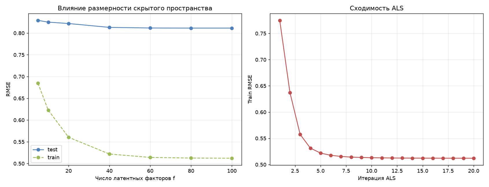

# Лабораторная работа №5. Рекомендательные системы (SLIM и ALS)

**Студент:** Хакимов В. М.

## Задача

Реализовать SLIM и латентную семантическую модель, оценить качество по RMSE,
сравнить с эталонными реализациями и посчитать NDCG (задача со звёздочкой).

В качестве латентной модели реализована **ALS-факторизация**: матрица оценок
приближается матрицей низкого ранга, скрытые оси играют роль «тем».

## Датасет

**MovieLens** ([kaggle](https://www.kaggle.com/datasets/abhikjha/movielens-100k),
версия `ml-latest-small`), скачивается при запуске через `kagglehub`.

| | Исходно | После фильтрации |
|---|---|---|
| Оценок | 100 836 | 67 866 |
| Пользователей | 610 | 608 |
| Фильмов | 9 724 | 1 296 |
| Заполненность | 1.70% | 8.61% |



Убраны фильмы с менее чем 20 оценками и пользователи с менее чем 10. Медианный
фильм в исходных данных имел 3 оценки — такие объекты не дают ничего ни
обучению, ни оценке качества, но раздувают матрицу в 7.5 раза.

**Разбиение — по пользователям:** у каждого случайные 20% его оценок уходят в
тест. Случайное разбиение по всем оценкам дало бы в тесте пользователей и
фильмы, отсутствующие в обучении, то есть задачу холодного старта.

Итоговая матрица **608 × 1 296**: 54 294 оценки в обучении, 13 572 в тесте.

## Результаты

### Итоговое сравнение

| Модель | RMSE | MAE | NDCG@10 | Обучение, с |
|---|---|---|---|---|
| базовый предиктор (μ + b_u + b_i) | 0.8407 | 0.6427 | 0.8241 | 0.009 |
| **своя: SLIM** | 0.8236 | 0.6266 | 0.8382 | 4.00 |
| эталон: SLIM на `ElasticNet` | 0.8236 | 0.6266 | 0.8382 | **1.49** |
| **своя: ALS-факторизация** | **0.8115** | **0.6194** | **0.8401** | 3.21 |
| эталон: `TruncatedSVD` | 0.8348 | 0.6369 | 0.8283 | 0.034 |



### SLIM: подбор регуляризации

| λ (L1) | RMSE | NDCG@10 | Ненулевых в W | Обучение, с |
|---|---|---|---|---|
| 0.05 | 0.8254 | 0.8354 | 229 363 | 7.8 |
| 0.5 | 0.8242 | 0.8368 | 172 934 | 5.6 |
| **1.0** | **0.8236** | 0.8382 | 122 680 | 4.2 |
| 3.0 | 0.8239 | **0.8389** | 36 627 | 2.1 |
| 10.0 | 0.8319 | 0.8341 | 1 653 | 0.9 |



Компромисс выгодный: при λ = 1.0 матрица весов заполнена на 7.31%, а RMSE лучше,
чем при λ = 0.05 с 229 тысячами весов. При λ = 3.0 весов в 6 раз меньше, RMSE
хуже лишь на 0.0003, а NDCG даже выше. То есть L1 не просто экономит память —
слабые связи между фильмами оказываются шумом, и их удаление улучшает
ранжирование. При λ = 10 регуляризация избыточна, модель почти вырождается в
базовый предиктор.

### SLIM: сравнение с эталоном

Эталон — покоординатный `ElasticNet` из sklearn, то есть та же задача,
решаемая промышленным решателем.

| Реализация | RMSE | NDCG@10 | Ненулевых в W | Обучение, с |
|---|---|---|---|---|
| своя (покоординатный спуск) | 0.8236 | 0.8382 | 122 680 | 4.00 |
| эталон (`ElasticNet`) | 0.8236 | 0.8382 | 122 681 | **1.49** |

**Результаты идентичны:** RMSE и NDCG совпадают во всех знаках, число ненулевых
весов различается на один из 122 тысяч. Самая сильная проверка корректности во
всей работе — два независимых решателя пришли в одну точку. По времени эталон
быстрее в 2.7 раза: у sklearn внутренний цикл на Cython.

Главная тонкость — согласование параметризации. sklearn минимизирует
`1/(2n)·‖y−Xw‖² + a·r·‖w‖₁ + 0.5·a·(1−r)·‖w‖²`, моя реализация —
`0.5·‖y−Xw‖² + λ‖w‖₁ + 0.5·β‖w‖²`. Отсюда `λ = n·a·r`, `β = n·a·(1−r)`. Без
этого пересчёта эталон при взятом наугад `alpha = 0.05` давал 310 весов вместо
122 тысяч, то есть просто решал другую задачу.

### Латентная модель

| Факторов f | 5 | 10 | 20 | 40 | 60 | 100 |
|---|---|---|---|---|---|---|
| train RMSE | 0.6846 | 0.6229 | 0.5604 | 0.5219 | 0.5141 | 0.5122 |
| test RMSE | 0.8292 | 0.8251 | 0.8219 | 0.8130 | 0.8117 | **0.8114** |



Тестовая ошибка убывает и выходит на плато после f ≈ 60. Переобучения по числу
факторов нет — его сдерживает L2-регуляризация, масштабируемая на число оценок
пользователя: у кого оценок мало, у того факторы сильно стянуты к нулю. Разрыв
train/test большой (0.51 против 0.81), но он не растёт. Основное падение train
RMSE происходит за первые 3-4 итерации.

Собственная реализация здесь **заметно лучше эталона** (0.8115 против 0.8348,
−2.8% RMSE). Причина принципиальная: `TruncatedSVD` раскладывает матрицу
остатков целиком, считая пропуски нулями, а при заполненности 6.89% это значит,
что 93% «данных» выдуманы. ALS оптимизирует ошибку только по наблюдённым
ячейкам. Цена — скорость: SVD в 94 раза быстрее, потому что это несколько
матричных умножений, а ALS решает 608 + 1 296 систем на каждой из 20 итераций.

### NDCG и качество ранжирования

Порядок моделей по NDCG совпадает с порядком по RMSE, но разрывы другие.
Базовый предиктор даёт 0.8241 — уже неплохо, он верно угадывает, какие фильмы
популярны в среднем; лучшая модель добавляет всего 1.6 п.п. Это объяснимо:
NDCG@10 считается по тестовым фильмам пользователя (в среднем ~22), большинство
оценены на 3-4, и верхние позиции трудно перепутать сильно.

Показательнее другое: при λ = 3.0 SLIM даёт лучший NDCG при худшем RMSE, чем
при λ = 1.0. Точность предсказания оценки и качество ранжирования — не одно и
то же.

**Гибрид (SLIM + ALS, 50/50):** RMSE 0.8125, **NDCG@10 = 0.8439** — лучший
результат по ранжированию во всей работе. Модели ошибаются по-разному: SLIM
опирается на прямые связи между фильмами, ALS — на латентные факторы, и
усреднение частично гасит обе ошибки.

**Покрытие каталога:** в топ-10 рекомендаций SLIM хотя бы одного пользователя
попадают 24.2% фильмов. Остальные три четверти не рекомендуются никому —
типичная проблема популярности, которую RMSE вообще не замечает.

## Выводы

1. Реализованы SLIM с покоординатным спуском по грам-матрице, ALS-факторизация
   и метрики RMSE, MAE, NDCG@k.
2. **Собственный SLIM в точности воспроизводит эталон:** RMSE и NDCG совпадают
   во всех знаках, число ненулевых весов различается на 1 из 122 680. Эталон
   быстрее в 2.7 раза.
3. **Собственный ALS превзошёл `TruncatedSVD`** (0.8115 против 0.8348), потому
   что оптимизирует ошибку только по наблюдённым ячейкам, а SVD подгоняется под
   93% выдуманных нулей. Цена — 94-кратное отставание по скорости.
4. Латентная модель обошла SLIM: при 6.89% заполненности низкоранговое
   приближение обобщает лучше прямых связей между фильмами.
5. L1-регуляризация работает не только на экономию: при λ = 3.0 весов в 6 раз
   меньше, а NDCG выше.
6. RMSE и NDCG измеряют разное — опираться только на RMSE при выборе модели
   некорректно.
7. При сравнении с эталоном критично согласовывать параметризацию
   регуляризации, иначе эталон решает другую задачу.

## Запуск

```
lab5/
├── README.md
├── images/
└── source/
    ├── models.py         # baseline, SLIM, ALS
    ├── metrics.py        # RMSE, MAE, NDCG@k, покрытие
    ├── dataset.py        # загрузка MovieLens и разбиение по пользователям
    ├── plots.py          # графики
    └── main.py           # сценарий эксперимента
```

```sh
pip install numpy pandas scipy scikit-learn matplotlib kagglehub
cd source && python main.py
```

Метрики воспроизводятся при повторном запуске; время зависит от машины.
